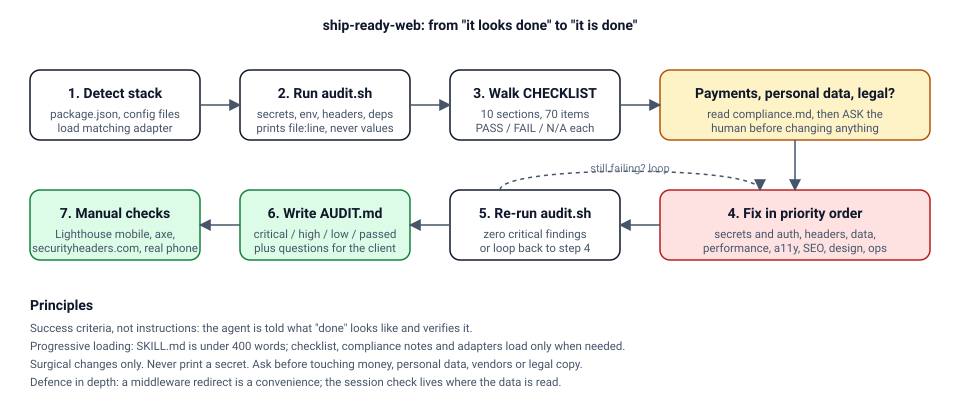

# ship-ready-web

A Claude Code skill that audits and hardens a website before handoff: secrets, security headers, data handling, performance, accessibility, SEO, design, and ops. Built for agencies shipping client sites with AI tools, where the site looks finished long before it is.

The skill is small on purpose. `SKILL.md` is under 400 words and only loads the checklist, compliance notes, or a framework adapter when the job needs them.



**Docs**: `docs/` in this repo, or the hosted site built from it in `site/` (Astro Starlight, deploys to Vercel). Start with `docs/02-quickstart-beginner.md` if you are new, `docs/03-step-by-step.md` if you are not.

## What you get

```
skills/ship-ready-web/
  SKILL.md                  workflow, rules, report template (always loaded)
  CHECKLIST.md              10 sections, critical items tagged [C]
  references/compliance.md  DPA, GDPR, PCI, HIPAA scoping and questions to ask
  adapters/nextjs/          next.config headers, proxy.ts, lib/auth-guard.ts, metadata, robots, sitemap, JSON-LD, .env.example
  scripts/audit.sh          deterministic checks, prints locations never values
docs/                       full documentation for beginners through experts, plus the case study
examples/broken-site/       demo site with 14 planted problems; run the audit on it
examples/fixed-site/        the same site after the workflow
site/                       Astro Starlight docs website, deploys to Vercel
.github/workflows/audit.yml gitleaks + audit on every push
```

## Try it in two minutes

```bash
cd examples/broken-site && bash ../../skills/ship-ready-web/scripts/audit.sh
cd ../fixed-site  && bash ../../skills/ship-ready-web/scripts/audit.sh
```

Six critical failures, then zero. The full story is in `docs/08-case-study.md`.

## Install

Clone into your Claude Code skills folder:

```bash
git clone <this-repo> ~/.claude/skills/ship-ready-web-repo
ln -s ~/.claude/skills/ship-ready-web-repo/skills/ship-ready-web ~/.claude/skills/ship-ready-web
```

Or copy just the skill folder:

```bash
cp -r skills/ship-ready-web ~/.claude/skills/
```

Restart Claude Code. The skill registers from its frontmatter. Per-project install: copy the folder to `.claude/skills/` inside the project instead.

Optional but recommended: `brew install gitleaks` (or your package manager) so the audit script can scan git history.

## Use

In any web project, open Claude Code and say something like:

- "Audit this site before handoff"
- "Is this production ready?"
- "Run the ship-ready checklist and fix the critical items"

Claude will run `scripts/audit.sh`, walk the checklist, fix what it can, ask before touching payments, personal data, or legal text, and write `AUDIT.md` for the client.

Run the script on its own any time:

```bash
bash ~/.claude/skills/ship-ready-web/scripts/audit.sh
```

## Add the Next.js adapter to a project

```bash
cp -r ~/.claude/skills/ship-ready-web/adapters/nextjs/* ./
cp ~/.claude/skills/ship-ready-web/adapters/nextjs/.env.example ./
```

Merge `next.config.mjs` with any existing config, wire `lib/auth-guard.ts` to your real session provider and call `requireUser()` in every protected page and route handler, and spread `baseMetadata` into `app/layout.tsx`. Targets Next.js 16 (`proxy.ts`); for 13 to 15 rename it to `middleware.ts`. See `adapters/nextjs/README.md`.

## Add CI to a client repo

Copy `.github/workflows/audit.yml` and the `scripts/audit.sh` file into the client repo. Every push then scans for secrets and runs the static checks.

## Design principles

- Success criteria, not instructions. The agent is told what "done" looks like and verifies it.
- Progressive loading. Only the checklist is always read; adapters and compliance notes load on demand.
- Surgical changes. The skill forbids wholesale rewrites.
- Ask before assuming. Payments, personal data, vendors, and legal copy always trigger a question.
- Never see secrets. The audit prints `file:line`, never the value.
- Defence in depth. A middleware redirect is a convenience; the session check lives where the data is read.

## Contributing

- Keep `SKILL.md` under 400 words. Detail goes in references or adapters.
- New framework? Add `adapters/<name>/` with its own README.
- No real credentials anywhere, including examples. CI will reject them.

## Roadmap

- [ ] Adapter: static HTML on Nginx / Cloudflare (headers via `_headers` and nginx.conf)
- [ ] Adapter: Astro
- [ ] Lighthouse CI config with mobile budgets
- [ ] Consent manager reference implementation
- [ ] Eval set for skill triggering (three starter prompts in `docs/07-expert-notes.md`)

## Not legal advice

`references/compliance.md` is scoping guidance. Get a lawyer for anything involving regulated data.

MIT. Built by Carlson Kamau.
